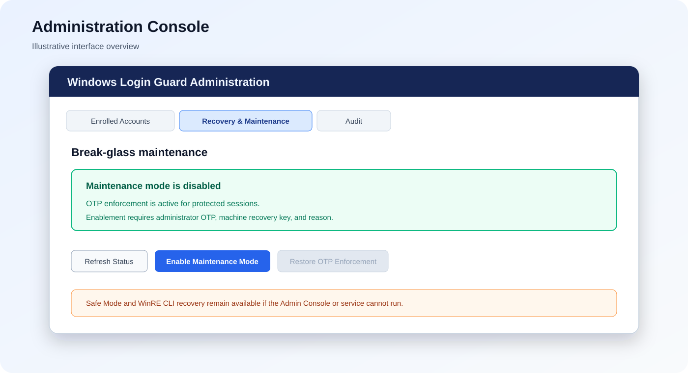
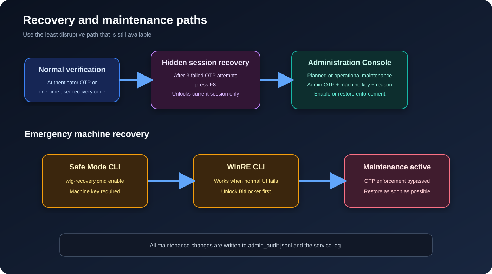

# Windows Login Guard


Windows Login Guard adds a post-login TOTP verification gate to selected Windows accounts. Windows completes the normal sign-in or unlock first, then Windows Login Guard requires an authenticator OTP, user recovery code, or authorized recovery path before the user can continue.

Current release: **v1.7.2**

> [!IMPORTANT]
> Windows Login Guard is post-login enforcement. It is not a Windows Credential Provider, pre-boot authentication system, BitLocker replacement, Windows Hello replacement, or domain authentication replacement.

## Contents

- [Features](#features)
- [Security model](#security-model)
- [Requirements](#requirements)
- [Quick start](#quick-start)
- [Installation](#installation)
- [Opening the Administration Console](#opening-the-administration-console)
- [Normal verification and enrollment](#normal-verification-and-enrollment)
- [User recovery codes](#user-recovery-codes)
- [Hidden F8 session recovery](#hidden-f8-session-recovery)
- [Maintenance mode](#maintenance-mode)
- [Safe Mode and WinRE CLI recovery](#safe-mode-and-winre-cli-recovery)
- [Configuration](#configuration)
- [Diagnostics and troubleshooting](#diagnostics-and-troubleshooting)
- [Upgrade](#upgrade)
- [Uninstallation](#uninstallation)
- [File locations](#file-locations)
- [Release history](#release-history)
- [Limitations](#limitations)

## Features

- Per-user TOTP enrollment
- QR-code and manual-key provisioning
- DPAPI-protected authenticator secrets
- One-time user recovery codes
- Configurable account protection scope
- Administrator authorization for enrollment
- Topmost or isolated-desktop verification UI
- Dedicated Administration Console
- Recovery-code regeneration
- OTP enrollment reset
- Hidden F8 session recovery after repeated OTP failures
- Machine-wide maintenance mode
- Safe Mode and Windows Recovery Environment recovery
- Administrative audit logging
- Upgrade-time service and UI validation

## Security model

The Windows service runs with elevated privileges and owns the protected data under:

```text
C:\ProgramData\WindowsLoginGuard\secure
```

The design uses:

- Windows DPAPI for TOTP-secret protection
- Restricted NTFS ACLs for protected files
- A local management token for Administration Console transport authentication
- Enrolled administrator OTP or recovery-code authorization for sensitive administrative operations
- A separate machine maintenance recovery key for break-glass actions
- Audit records for recovery, maintenance, reset, and regeneration operations

The maintenance recovery key is displayed once when first created. Only its SHA-256 hash is retained on the machine, so the existing key cannot be retrieved later. If it is lost, an enrolled administrator can rotate it from **Recovery & Maintenance → Rotate Maintenance Recovery Key**; the previous key is invalidated immediately.

Use BitLocker to reduce the risk of offline modification. Anyone with unrestricted administrative or offline write access to an unencrypted Windows volume remains inside the machine trust boundary.

## Requirements

- Windows 10 or Windows 11
- Administrator privileges for installation and Administration Console use
- 64-bit Python 3.11 or newer installed for all users
- A TOTP-compatible authenticator application
- BitLocker recommended for systems requiring offline protection

## Quick start

Install from an elevated PowerShell window:

```powershell
Set-ExecutionPolicy -Scope Process Bypass
.\install.ps1
```

Save the maintenance recovery key shown by the installer.

Open the Administration Console:

```powershell
& "C:\Program Files\WindowsLoginGuard\open-admin.ps1"
```

Lock Windows to test the verification gate:

```powershell
rundll32.exe user32.dll,LockWorkStation
```

## Installation

1. Extract the release package.
2. Open PowerShell as Administrator.
3. Change to the extracted folder.
4. Run:

```powershell
Set-ExecutionPolicy -Scope Process Bypass
.\install.ps1
```

The installer:

- Creates `C:\Program Files\WindowsLoginGuard`
- Creates the protected ProgramData structure
- Creates the Windows service
- Creates the Administration Console management token
- Generates the machine maintenance recovery key if one does not exist
- Applies restricted NTFS permissions
- Starts the service
- Preserves existing protected data when appropriate

### Save the machine maintenance recovery key

The installer displays a key similar to:

```text
0123ABCD-4567EF89-0123ABCD-4567EF89-0123ABCD
```

Store it in a protected password manager or offline record. It is not the same as a user's one-time recovery codes.

The key cannot be recovered from the stored SHA-256 hash.

## Opening the Administration Console



Open PowerShell as Administrator and run:

```powershell
& "C:\Program Files\WindowsLoginGuard\open-admin.ps1"
```

The Administration Console requires elevation.

### Enrolled Accounts

The **Enrolled Accounts** tab provides:

- Account and role inventory
- Enrollment status
- Remaining user recovery-code count
- Last recovery-code generation time
- Recovery-code regeneration
- OTP enrollment reset

Recovery-code regeneration and OTP reset require an enrolled administrator's OTP or one-time administrator recovery code.

### Recovery & Maintenance

The **Recovery & Maintenance** tab provides:

- Current maintenance status
- Maintenance enablement details
- **Enable Maintenance Mode**
- **Restore OTP Enforcement**

Enabling or disabling maintenance mode requires:

1. An elevated Administration Console
2. An enrolled administrator OTP or administrator recovery code
3. The machine maintenance recovery key
4. A mandatory reason when enabling maintenance mode
5. Explicit confirmation

### Audit

The Admin Console converts stored UTC audit timestamps to the PC's current local time zone and labels them **Timestamp (Local)**. Audit records remain stored in UTC so they retain a consistent source-of-truth format across daylight-saving and time-zone changes.


The **Audit** tab shows recent administrative operations, including:

- Recovery-code regeneration
- OTP reset
- Session recovery
- Maintenance-mode enablement
- Maintenance-mode disablement

## Normal verification and enrollment

When a protected session signs in or unlocks, Windows Login Guard opens its verification UI.

An enrolled user can enter:

- The current six-digit TOTP from the authenticator application
- An unused one-time user recovery code

An unenrolled protected account is guided through enrollment:

1. Administrator authorization, if required by policy
2. QR code or manual secret provisioning
3. TOTP confirmation
4. One-time recovery-code generation
5. Recovery-code acknowledgement

The verification field should receive keyboard focus automatically.

## User recovery codes

User recovery codes are generated during enrollment and can be regenerated from the Administration Console.

Each recovery code:

- Is one-time use
- Is stored only as a hash
- Becomes invalid after successful use
- Is separate from the machine maintenance recovery key

Regenerating codes invalidates all previous unused codes for that user but does not change the authenticator secret.

The Administration Console recovery-code dialog supports:

- Copy
- Save As
- Continue

## Hidden F8 session recovery

The normal OTP window does not show a recovery button or recovery hint.

Recovery becomes available only after three failed OTP submissions. It still remains hidden until the user presses:

```text
F8
```

Before three failed submissions, `F8` has no effect.

The hidden recovery screen:

- Requires the machine maintenance recovery key
- Requires a recovery reason
- Displays the long recovery key while it is entered
- Automatically formats the key into groups
- Pauses the normal OTP timeout
- Extends the separate recovery-entry timeout while the user is typing
- Unlocks only the current Windows session

The session-only bypass expires when:

- Windows is locked
- The user signs out
- The Windows Login Guard service restarts

The F8 recovery screen cannot enable machine-wide maintenance mode.

## Maintenance recovery key management

The installer displays the machine maintenance recovery key once. Save it offline. The application stores only its SHA-256 hash and therefore cannot display the existing key later.

If the key was not saved or has been lost:

1. Open the Administration Console as Administrator.
2. Open **Recovery & Maintenance**.
3. Select **Rotate Maintenance Recovery Key**.
4. Authorize the rotation with an enrolled administrator OTP or one-time recovery code.
5. Copy or save the new key from the one-time display.

Rotation does not require the old key. It requires the elevated local Administration Console, the management token, and an enrolled administrator credential. The previous key stops working immediately, and the rotation is audited.

## Maintenance mode



Maintenance mode disables OTP enforcement for all protected sessions. Use it only for planned maintenance or when the verifier, service, UI, runtime, or protected data requires repair.

### Enable maintenance mode from the Administration Console

This is the preferred path when normal Windows and the service are operational.

1. Open elevated PowerShell.
2. Run:

```powershell
& "C:\Program Files\WindowsLoginGuard\open-admin.ps1"
```

3. Open **Recovery & Maintenance**.
4. Select **Enable Maintenance Mode**.
5. Confirm the warning.
6. Enter a reason.
7. Select an enrolled administrator.
8. Enter that administrator's OTP or one-time recovery code.
9. Enter the machine maintenance recovery key.

When enabled:

- Active verification gates are cleared
- New protected sessions bypass OTP
- The administrator, timestamp, source, and reason are audited
- Maintenance remains enabled until explicitly disabled

### Restore OTP enforcement from the Administration Console

1. Open the Administration Console.
2. Open **Recovery & Maintenance**.
3. Select **Restore OTP Enforcement**.
4. Confirm the operation.
5. Enter an enrolled administrator OTP or administrator recovery code.
6. Enter the machine maintenance recovery key.

Maintenance mode is then disabled and normal OTP enforcement resumes.

> [!WARNING]
> Do not leave maintenance mode enabled after the maintenance or incident has ended.

## Safe Mode and WinRE CLI recovery

The CLI is the emergency path when the Administration Console, Python runtime, verification UI, or Windows Login Guard service cannot be used normally.

The CLI `enable` action is accepted only in Safe Mode or Windows Recovery Environment.

### Enable maintenance mode from Safe Mode

Enter Safe Mode using Windows Advanced Startup:

1. Open **Settings**.
2. Open **System → Recovery**.
3. Under **Advanced startup**, select **Restart now**.
4. Select **Troubleshoot → Advanced options → Startup Settings**.
5. Select **Restart**.
6. Press `4` for Safe Mode or `5` for Safe Mode with Networking.
7. Open Command Prompt as Administrator.
8. Run:

```cmd
cd /d "C:\Program Files\WindowsLoginGuard"
wlg-recovery.cmd enable
```

Enter the machine maintenance recovery key when prompted, then restart Windows normally.

### Enable maintenance mode from WinRE

1. Hold `Shift` while selecting **Restart**.
2. Select **Troubleshoot**.
3. Select **Advanced options**.
4. Select **Command Prompt**.
5. Unlock the Windows volume if BitLocker requests its recovery key.
6. Locate the installed Windows volume.

In WinRE, Windows may be mounted as `D:` instead of `C:`:

```cmd
D:
cd "\Program Files\WindowsLoginGuard"
wlg-recovery.cmd enable
```

The script searches mounted drive letters for:

```text
ProgramData\WindowsLoginGuard\secure\maintenance-key.sha256
```

Restart Windows after maintenance mode is enabled.

### Disable maintenance mode from Safe Mode or WinRE

Run:

```cmd
wlg-recovery.cmd disable
```

The machine maintenance recovery key is required.

The Administration Console remains the preferred way to restore enforcement when normal Windows is operational.

## Configuration

The active configuration is stored at:

```text
C:\ProgramData\WindowsLoginGuard\secure\config.json
```

The release includes:

```text
config.example.json
```

Important recovery defaults include:

```json
{
  "max_otp_attempts": 5,
  "recovery_otp_failure_threshold": 3,
  "recovery_entry_timeout_seconds": 600
}
```

The recovery threshold must not exceed `max_otp_attempts`.

Use the configuration script from an elevated PowerShell window:

```powershell
.\configure.ps1
```

Review and test configuration changes before production deployment.


## Monitoring Dashboard

The Administration Console opens with a read-only Dashboard showing service status and uptime, maintenance status, enrolled-account totals, active Windows sessions, verification gates, remaining timeout, failed attempts, and hidden F8 recovery availability.

The Live Sessions table is read-only in v1.6.0. It cannot terminate sessions, bypass verification, approve users, or change policy.


## Administration Console v1.7

Version 1.7 refactors the Administration Console around a shared local IPC client and a persistent status bar.

The Dashboard now:

- retrieves real Windows sessions using the service session enumerator
- reports service version, status, startup type, PID, start time, and uptime
- refreshes automatically every five seconds
- detects service restarts and reconnects automatically
- identifies Admin Console/service version mismatches
- shows health checks, notifications, live verification state, timers, failed attempts, F8 recovery readiness, and recent audit activity
- displays specific IPC and service errors instead of blank cards

The Configuration page now:

- loads all controls and selection choices from the service schema
- shows friendly labels for policy choices, including 30 minutes, 2 hours, and 4 hours
- uses normal editable numeric text fields
- validates numeric fields on focus loss and before Apply
- keeps Apply disabled while values are invalid or unchanged
- performs authoritative service-side validation before writing
- saves atomically, restarts the service, reconnects, and refreshes the console

The Diagnostics tab reports the Windows service, IPC endpoint, configuration, secure storage, audit storage, maintenance recovery key, Windows DPAPI, important file paths, and component versions.

## Configuration management in the Administration Console

Open the Administration Console:

```powershell
& "C:\Program Files\WindowsLoginGuard\open-admin.ps1"
```

Open the **Configuration** tab. Settings are separated into nested tabs for Verification, Recovery, Enrollment, Policy, Failure handling, and User interface. Each field includes a plain-language description.

The configuration editor is schema-driven:

- Boolean settings use checkboxes.
- String policy settings use read-only dropdown selections.
- Numeric settings use bounded spinboxes.
- Numeric values are limited by both the UI and the service.
- The F8 recovery threshold cannot exceed the maximum OTP-attempt limit.
- Unknown settings are rejected.
- Saving requires an enrolled administrator OTP or recovery code.
- Changes are previewed before confirmation.
- The service writes `config.json` atomically and records the old and new values in the audit log.
- After a successful change, the Administration Console automatically restarts the `WindowsLoginGuard` service so all runtime components use the new policy.

Identity data, SIDs, secure paths, tokens, the issuer label, and internal protocol settings are not editable through this screen.

## Diagnostics and troubleshooting

Run the diagnostic script from the extracted release folder:

```powershell
.\diagnose.ps1
```

### Check the installed version

```powershell
Get-Content "C:\Program Files\WindowsLoginGuard\VERSION"
```

### Check service status

```powershell
Get-Service WindowsLoginGuard
```

Expected state:

```text
Running
```

### Restart the service

```powershell
Restart-Service WindowsLoginGuard -Force
```

A service restart ends any session-only F8 recovery bypass.

### Review the service log

```powershell
Get-Content `
  "C:\ProgramData\WindowsLoginGuard\secure\guard.log" `
  -Tail 100
```

### Review the administrative audit log

```powershell
Get-Content `
  "C:\ProgramData\WindowsLoginGuard\secure\admin_audit.jsonl" `
  -Tail 100
```

The audit log includes verification challenge creation, invalid OTP attempts, successful verification, verification timeouts or attempt-limit actions, maintenance-key rotation, break-glass recovery, maintenance-mode changes, OTP resets, and recovery-code regeneration. OTP values and recovery keys are never written to the audit log.

### OTP prompt does not appear

Check:

```powershell
Get-Service WindowsLoginGuard
Get-Content "C:\Program Files\WindowsLoginGuard\VERSION"
.\diagnose.ps1
```

Then review `guard.log`.

The upgrade script performs:

- Python service-module import validation
- Hidden Tk UI startup validation
- Service restart validation

### OTP field does not receive focus

Confirm that v1.2.1 or later is installed. Lock the workstation again and verify that no other application is forcing itself to the foreground.

### OTP codes are consistently rejected

Confirm the Windows clock is synchronized:

```powershell
w32tm /query /status
w32tm /resync
```

### F8 does nothing

F8 recovery becomes available only after three failed OTP submissions. It remains hidden before the threshold is reached.

### Administration Console does not open

Run it from elevated PowerShell:

```powershell
& "C:\Program Files\WindowsLoginGuard\open-admin.ps1"
```

Then review the service status and `guard.log`.

### Maintenance recovery key was lost

The existing key cannot be recovered because only its SHA-256 hash is stored. Open the elevated Administration Console, go to **Recovery & Maintenance**, and select **Rotate Maintenance Recovery Key**. Authorize the action with an enrolled administrator OTP or one-time recovery code, then save the newly displayed key offline.

## Upgrade

To upgrade the installed release to v1.7.2:

```powershell
Set-ExecutionPolicy -Scope Process Bypass
.\upgrade-to-v1.7.2.ps1
```

The upgrade:

- Stops the service
- Stops active Login Guard UI processes
- Creates a timestamped backup under the installation directory
- Replaces the updated modules
- Preserves enrollments, policies, recovery codes, management token, maintenance key, and maintenance state
- Validates service imports
- Runs a hidden UI startup check
- Restarts and verifies the service

After upgrading, confirm:

```powershell
Get-Content "C:\Program Files\WindowsLoginGuard\VERSION"
Get-Service WindowsLoginGuard
```

Expected version:

```text
1.7.2
```

## Uninstallation

Run from an elevated PowerShell window:

```powershell
.\uninstall.ps1
```

Review the script first if protected enrollment data, logs, or configuration must be retained.

## File locations

Installation:

```text
C:\Program Files\WindowsLoginGuard
```

Protected data:

```text
C:\ProgramData\WindowsLoginGuard\secure
```

Important protected files:

```text
config.json
management.token
maintenance-key.sha256
maintenance.json
admin_audit.jsonl
guard.log
users\
```

The maintenance recovery key itself is not stored there—only its SHA-256 hash.

## Release history

- **v1.7.2** — Added an elevated desktop shortcut for the Administration Console and converted Audit and Recent Activity timestamps from stored UTC to the PC's local time zone for display
- **v1.7.1** — Added one-time maintenance-key rotation, migrated approval duration choices to include 30 minutes, 2 hours, and 4 hours, retained failed-attempt counts for dashboard visibility, and audited verification challenges, invalid OTPs, successful verification, timeouts, and failure actions
- **v1.7.0** — Refactored the Administration Console with a shared IPC client, functional auto-refreshing Dashboard, version checks, diagnostics, service restart/reconnect workflow, friendly schema choices, and normally editable bounded numeric fields
- **v1.6.0** — Added a read-only monitoring dashboard with service health, maintenance state, enrollment totals, active sessions, verification status, timeout, failed-attempt, and F8 recovery visibility
- **v1.5.2** — Fixed clipped Configuration action buttons, automatically restarts the service after policy changes, removed redundant selection-field wording, and added 30-minute, 2-hour, and 4-hour approval durations
- **v1.5.1** — Configuration settings grouped into section tabs with plain-language field descriptions and visible numeric range guidance
- **v1.5.0** — Schema-driven Admin Console configuration management with checkboxes, read-only selections, bounded numeric inputs, service-side validation, atomic reload, change preview, and audit history
- **v1.4.1** — Fixed recovery Back rendering error, added representative UI render validation, and restored gate-before-UI startup ordering for faster isolated-desktop protection
- **v1.4.0** — Administration Console maintenance enable/disable with enrolled administrator authorization, machine recovery key, reason, auditing, and complete illustrated README
- **v1.3.1** — Hidden F8 recovery no longer opens automatically
- **v1.3.0** — Hidden recovery threshold, visible formatted key entry, paused recovery timer, and Safe Mode/WinRE machine recovery
- **v1.2.1** — OTP UI startup regression fix and deterministic OTP-field focus
- **v1.2.0** — Initial pre-OTP recovery UI and WinRE fallback
- **v1.1.0** — Initial maintenance recovery key
- **v1.0.2** — Administration launcher runtime discovery
- **v1.0.1** — Windows PowerShell RNG compatibility
- **v1.0.0** — Administration Console, OTP reset, recovery regeneration, metadata, and audit logging
- **v0.9.x** — Isolated-desktop and verification UI refinements
- **v0.8.x** — User recovery codes and administrator approval improvements
- **v0.1.0–v0.7.x** — Initial service, enrollment, storage, session, and Windows integration work

## Limitations

- Windows Login Guard is post-login enforcement, not pre-authentication.
- Local administrators remain part of the trust boundary.
- A person with unrestricted offline access to an unencrypted Windows volume can alter local enforcement.
- Machine maintenance mode intentionally bypasses OTP enforcement.
- WinRE behavior and available utilities can vary across Windows builds.
- Test installation, enrollment, OTP verification, user recovery codes, hidden F8 recovery, Admin Console maintenance, Safe Mode recovery, WinRE recovery, upgrades, and uninstall procedures before production deployment.

## License

Add the selected open-source license before publishing the repository.


### Desktop appears briefly before the OTP window

For the strongest post-login presentation, set:

```json
{
  "interaction_mode": "isolated_desktop",
  "isolated_desktop_fallback": "topmost"
}
```

v1.4.1 creates the verification gate before waiting for the UI process, allowing the first UI status poll to move directly to the isolated verification desktop. Windows Login Guard remains a post-login control, so it cannot provide the same pre-desktop guarantee as a Credential Provider.
