# Windows Login Guard

**Post-login TOTP enforcement, recovery, maintenance, and administration for
Windows accounts.**

Windows Login Guard adds an account-specific verification gate after Windows
sign-in, workstation unlock, or service start. Windows completes its normal
password, PIN, Windows Hello, or biometric authentication first. Windows Login
Guard then requires a current six-digit TOTP, a one-time user recovery code, an
authorized approval, or a controlled break-glass recovery path before the
session is treated as verified.


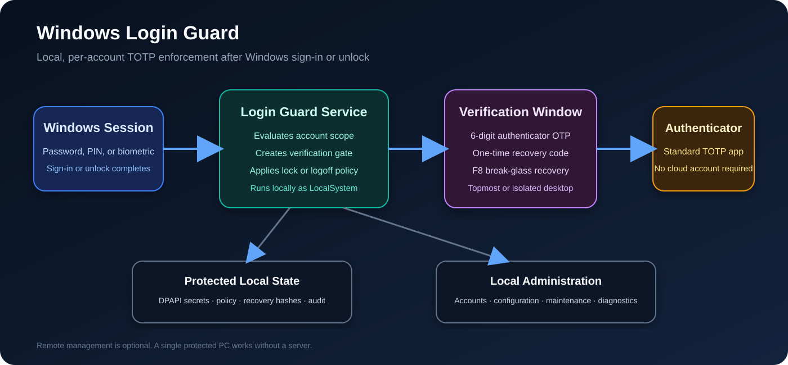

> **Important**
>
> Windows Login Guard is post-login enforcement. It is not a Windows Credential
> Provider, pre-boot authentication system, BitLocker replacement, Windows
> Hello replacement, domain authentication replacement, or password manager.

## Contents

- [What it is for](#what-it-is-for)
- [Features](#features)
- [Deployment choices](#deployment-choices)
- [Security model](#security-model)
- [Requirements and preflight](#requirements-and-preflight)
- [Quick start: one standalone PC](#quick-start-one-standalone-pc)
- [First account enrollment](#first-account-enrollment)
- [Normal verification](#normal-verification)
- [Opening Windows Login Guard Administration](#opening-windows-login-guard-administration)
- [Enrolling another account](#enrolling-another-account)
- [User recovery codes](#user-recovery-codes)
- [Hidden F8 session recovery](#hidden-f8-session-recovery)
- [Maintenance mode](#maintenance-mode)
- [Safe Mode and WinRE recovery](#safe-mode-and-winre-recovery)
- [Configuration](#configuration)
- [Diagnostics and troubleshooting](#diagnostics-and-troubleshooting)
- [Optional remote management](#optional-remote-management)
- [Upgrade and uninstall](#upgrade-and-uninstall)
- [File locations](#file-locations)
- [Limitations](#limitations)

## What it is for

Windows Login Guard is intended for Windows PCs where selected local sessions
should require a separate authenticator credential after normal Windows
authentication.

Typical deployments include:

- one family or personal PC;
- an administrator or support workstation;
- a shared lab, classroom, or small-office computer;
- several independently managed PCs;
- centrally monitored protected PCs using the optional remote-management role.

A single protected PC does **not** require a management server, web browser,
database server, second computer, Microsoft cloud account, or inbound firewall
rule.

## Features

Local features:

- per-Windows-account TOTP enrollment;
- QR-code and manual-key provisioning;
- DPAPI-protected TOTP secrets;
- one-time user recovery codes stored as hashes;
- configurable protection scope;
- administrator authorization for enrollment;
- verification after sign-in, unlock, and optional service start;
- topmost or isolated-desktop verification;
- configurable timeout, attempt limits, and allow/lock/logoff actions;
- local administrator approval workflows;
- dedicated local Administration console;
- recovery-code regeneration;
- OTP enrollment reset and account revocation;
- hidden F8 session recovery after repeated OTP failures;
- machine-wide maintenance mode;
- maintenance recovery-key rotation;
- Safe Mode and Windows Recovery Environment recovery;
- local audit logging and diagnostics;
- upgrade-time service and UI validation;
- service-owned lock and fallback enforcement when the verification UI fails.

Optional remote-management features:

- central protected-device inventory and health;
- remote approval requests and Admin-PC notifications;
- remote Approve and Deny;
- remote Lock Session and Log Off Session;
- signed device-specific commands;
- central audit history;
- endpoint retry backoff during server outages.

## Deployment choices

| Deployment | Description | Remote server |
|---|---|---|
| One standalone PC | Local OTP protection and local Administration on one PC | Not required |
| Several standalone PCs | Each PC has independent configuration and enrollment | Not required |
| One PC with all roles | Protected PC, management server, and Admin app on one PC | Installed locally |
| Central management | One server/Admin PC manages other protected PCs | Required |

Start with the standalone-PC workflow unless central management is already
required.

## Security model

The Windows service runs with elevated privileges and owns protected state
under:

```text
C:\ProgramData\WindowsLoginGuard\secure
```

The local design uses:

- Windows DPAPI for TOTP-secret and token protection;
- restricted NTFS ACLs for protected files;
- a machine-local management token for Administration-console IPC
  authentication;
- an enrolled administrator OTP or one-time administrator recovery code for
  sensitive administrative operations;
- a separate machine maintenance recovery key for break-glass actions;
- SHA-256 hashes for the maintenance key and user recovery codes;
- local audit records for verification, recovery, maintenance, resets,
  configuration changes, and remote commands.

The maintenance recovery key is displayed when created. Only its SHA-256 hash
is retained, so the current plaintext key cannot be retrieved later. An
enrolled administrator can rotate it without the old key; rotation invalidates
the previous key immediately and is audited.

Use BitLocker when offline tampering is a concern. A local administrator or a
person with unrestricted offline write access to an unencrypted Windows volume
is inside the machine trust boundary.

Full details: [Local Security Model](docs/SECURITY_MODEL.md).

## Requirements and preflight

Required:

- Windows 10 or Windows 11, 64-bit;
- an elevated local-administrator PowerShell session;
- Windows PowerShell 5.1 or newer;
- 64-bit CPython 3.11 or newer installed for all users;
- `pip` and Python's built-in Tcl/Tk GUI support;
- package-repository access during dependency installation;
- accurate Windows and authenticator-device clocks;
- a TOTP-compatible authenticator;
- separate storage for recovery material.

Prepare the extracted release:

```powershell
Get-ChildItem -LiteralPath . -Recurse -File |
    Unblock-File

Set-ExecutionPolicy `
    -Scope Process `
    -ExecutionPolicy Bypass `
    -Force

.\test-prerequisites.ps1 -Role ProtectedPc
```

The preflight checker performs the pip dependency-resolution dry run
internally. Do not run a separate pip command during normal preparation.

Full requirements:
[Windows Installation Prerequisites](docs/PREREQUISITES.md).

## Quick start: one standalone PC

After the preflight reports no failures:

```powershell
.\install-protected-pc.ps1
```

Do not supply `ServerUrl`, `RegistrationCode`, or `ServerCertificate`.

The installer:

- creates `C:\Program Files\WindowsLoginGuard`;
- creates restricted state under `C:\ProgramData\WindowsLoginGuard`;
- installs and starts the `WindowsLoginGuard` service;
- configures Windows service recovery;
- creates the local Administration management token;
- creates the elevated Administration desktop shortcut;
- generates the machine maintenance recovery key when needed;
- preserves existing protected data during an appropriate reinstall or upgrade;
- opens the first-account enrollment workflow.

Save the maintenance recovery key displayed by the installer.

Lock Windows to test the verification gate:

```powershell
rundll32.exe user32.dll,LockWorkStation
```

## First account enrollment

The trusted installer account receives a one-time initial-enrollment flow.

The following screenshot is from the disposable lab VM used in the supplied
recording. The values are lab-only examples.

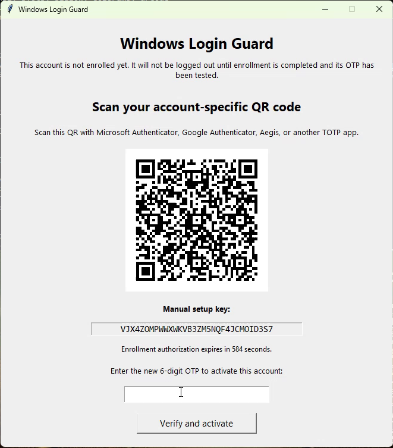

1. Select **Begin initial enrollment**.
2. Scan the account-specific QR code with a TOTP authenticator.
3. Use the displayed manual setup key when scanning is unavailable.
4. Enter the current six-digit code.
5. Select **Verify and activate**.
6. Save the one-time recovery codes.
7. Select **Continue**.

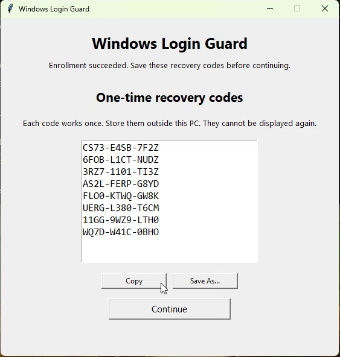

Each account receives its own TOTP secret and recovery-code set. The QR code,
manual key, and recovery codes should be treated as account credentials in a
real deployment.

Detailed procedure:
[Installation and First Enrollment](docs/INSTALLATION.md).

## Normal verification

When a protected session signs in or unlocks, Windows Login Guard displays its
verification UI.

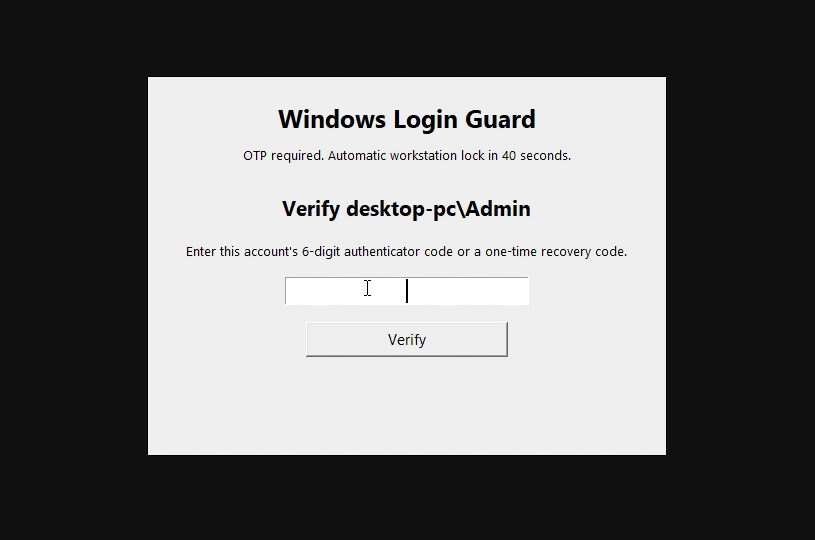

An enrolled user may enter:

- the current six-digit TOTP;
- an unused one-time user recovery code.

The OTP field receives focus automatically. With automatic submission enabled,
a complete six-digit OTP is submitted after the configured delay.

When verification expires or reaches the attempt limit, the configured action
is applied. Sign-in, unlock, service-start, approval-timeout, and out-of-scope
denial may have separate allow, lock, or logoff policies.

## Opening Windows Login Guard Administration

The local Administration console is installed on every protected PC, including
a standalone PC with no remote server.

Use the elevated desktop shortcut:

```text
Windows Login Guard Administration
```

Or run:

```powershell
& "C:\Program Files\WindowsLoginGuard\open-admin.ps1"
```

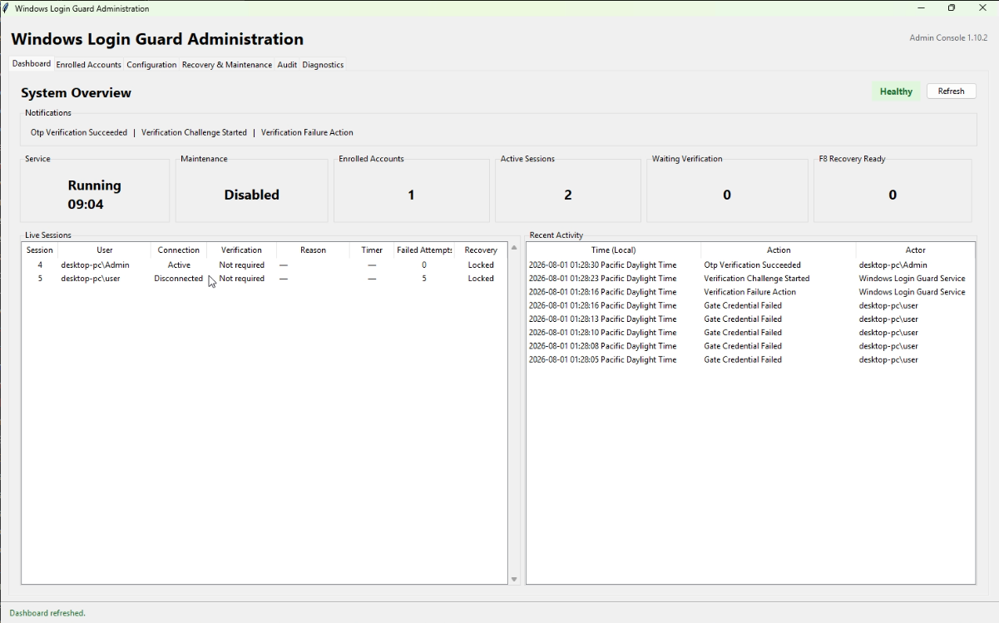

The console requires local administrator elevation. Opening it does not by
itself request an OTP, but sensitive changes require an enrolled administrator
OTP or one-time administrator recovery code.

The tabs are:

- **Dashboard** — service health, version, startup type, PID, uptime,
  notifications, active sessions, verification state, timers, failed attempts,
  F8 readiness, and recent activity.
- **Enrolled Accounts** — account inventory, role, enrollment status, remaining
  recovery codes, recovery-code regeneration, and OTP reset.
- **Configuration** — schema-driven Verification, Recovery, Enrollment, Policy,
  Failure handling, and User interface settings.
- **Recovery & Maintenance** — maintenance status, enable/disable maintenance,
  and rotate the machine recovery key.
- **Audit** — recent administrative and enforcement records displayed in local
  time while remaining stored in UTC.
- **Diagnostics** — service, IPC, configuration, storage, DPAPI, file-path, and
  component-version checks.

The Dashboard refreshes every five seconds, reconnects after service restarts,
reports Admin-console/service version mismatches, and shows specific connection
errors instead of silently blank cards.

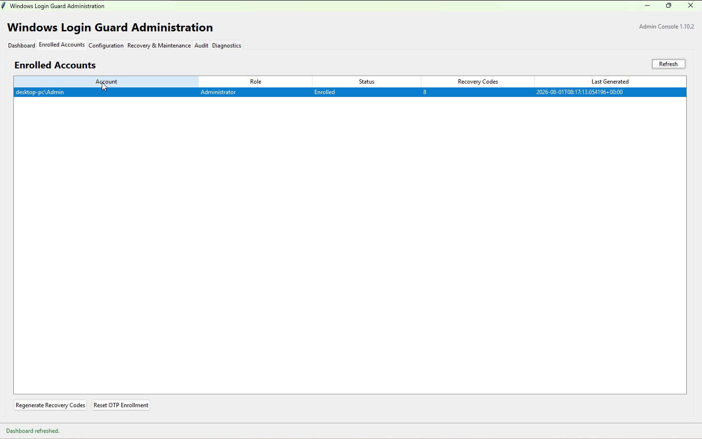

Full console reference:
[Local Administration Guide](docs/LOCAL_ADMINISTRATION.md).

## Enrolling another account

When another in-scope Windows account signs in, Windows Login Guard starts an
enrollment workflow.

When policy requires authorization:

1. Select an enrolled administrator.
2. Enter that administrator's current OTP or one-time recovery code.
3. Select **Authorize enrollment**.
4. The new account scans its own QR code.
5. The new account confirms its own six-digit TOTP.
6. Save the new account's recovery codes.

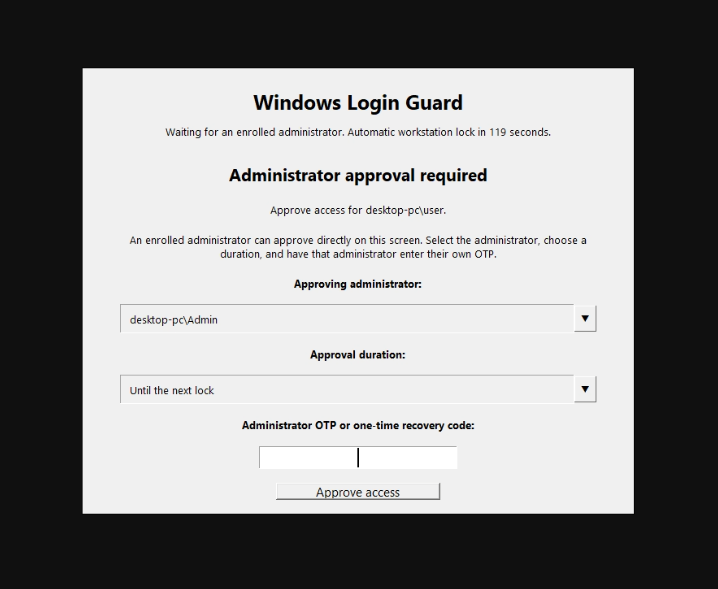

### Find the target account SID

For the account running the current PowerShell process:

```powershell
whoami /user
```

To list local accounts and their SIDs:

```powershell
Get-LocalUser |
    Select-Object Name, Enabled, SID
```

To authorize a specific local account:

```powershell
$targetSid = (
    Get-LocalUser -Name "AccountName"
).SID.Value

& "C:\Program Files\WindowsLoginGuard\authorize-initial-enrollment.ps1" `
    -UserSid $targetSid
```

When the elevated PowerShell window uses a different administrator account,
retrieve the currently signed-in interactive user's SID instead:

```powershell
$interactiveUser = (Get-CimInstance Win32_ComputerSystem).UserName

$targetSid = (
    New-Object System.Security.Principal.NTAccount($interactiveUser)
).Translate(
    [System.Security.Principal.SecurityIdentifier]
).Value
```

Confirm that the SID resolves to the intended account before authorizing it.
See [Finding a Windows Account SID](docs/ACCOUNT_SIDS.md) for local, domain,
Microsoft-account, and verification examples.

## User recovery codes

User recovery codes are generated during enrollment and may be regenerated from
**Enrolled Accounts**.

Each recovery code:

- belongs to one account;
- is one-time use;
- is stored only as a hash;
- becomes invalid after successful use;
- may be entered in the normal OTP field;
- is separate from the machine maintenance recovery key.

Regenerating codes invalidates every previous unused recovery code for that
account but does not change the TOTP authenticator secret.

The one-time display supports **Copy**, **Save As...**, and **Continue**.

## Hidden F8 session recovery

The normal OTP window does not display a recovery button or recovery hint.

F8 recovery becomes available only after the configured number of failed OTP
submissions. The default is three failures. Before the threshold is reached,
pressing `F8` has no effect.

After the threshold:

```text
F8
```

opens the hidden break-glass screen.

The recovery screen:

- requires the machine maintenance recovery key;
- requires a recovery reason;
- displays the long key while it is entered;
- automatically formats the key into groups;
- pauses the normal OTP timeout;
- extends the separate recovery-entry timeout while the user types;
- unlocks only the current Windows session;
- cannot enable machine-wide maintenance mode.

The session-only bypass is cleared when:

- Windows is locked;
- the user signs out;
- the service restarts.

Detailed behavior:
[Recovery and Maintenance](docs/RECOVERY_AND_MAINTENANCE.md).

## Maintenance mode

Maintenance mode disables OTP enforcement for all protected sessions. Use it
only for planned maintenance or repair.

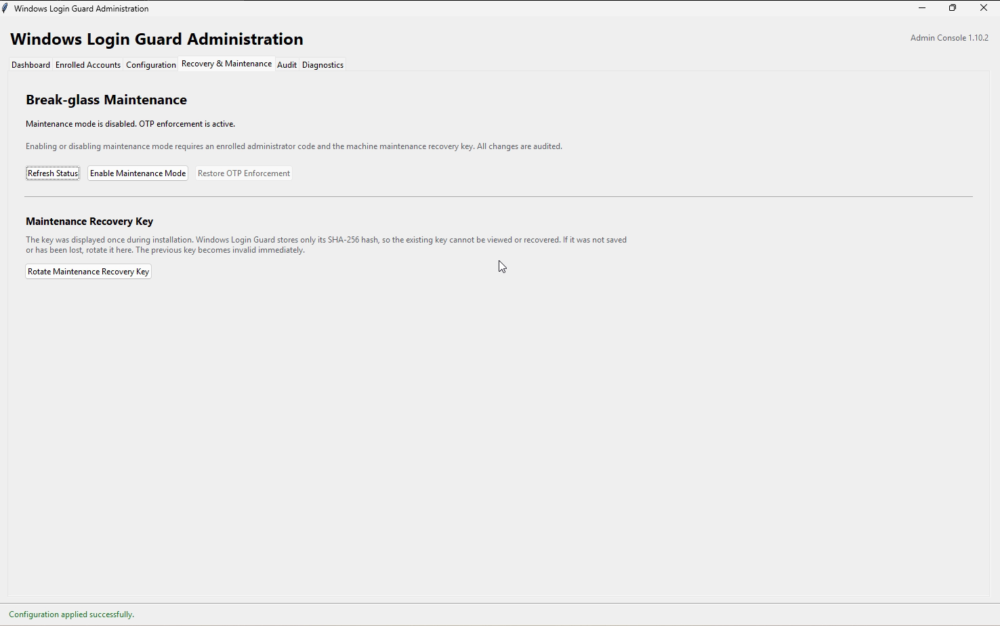

To enable it from the local console:

1. Open **Recovery & Maintenance**.
2. Select **Enable Maintenance Mode**.
3. Confirm the warning.
4. Enter a mandatory reason.
5. Select an enrolled administrator.
6. Enter that administrator's OTP or one-time recovery code.
7. Enter the machine maintenance recovery key.

When enabled:

- active verification gates are cleared;
- new protected sessions bypass OTP;
- the actor, timestamp, source, and reason are audited;
- maintenance remains enabled until explicitly disabled.

To restore enforcement, select **Restore OTP Enforcement** and provide both an
enrolled administrator credential and the machine maintenance key.

Do not leave maintenance mode enabled after maintenance ends.

### Rotate the maintenance recovery key

When the key is lost or exposed:

1. Open **Recovery & Maintenance**.
2. Select **Rotate Maintenance Recovery Key**.
3. Authorize with an enrolled administrator credential.
4. Save the new one-time displayed key.

The old maintenance key is not required. The previous key stops working
immediately.

## Safe Mode and WinRE recovery

Use `wlg-recovery.cmd` when the Administration console, Python runtime, service,
or normal verification UI cannot be used.

Safe Mode:

1. Open **Settings → System → Recovery**.
2. Under **Advanced startup**, select **Restart now**.
3. Select **Troubleshoot → Advanced options → Startup Settings**.
4. Select **Restart**.
5. Press `4` for Safe Mode or `5` for Safe Mode with Networking.
6. Open Command Prompt as Administrator.
7. Run:

```cmd
cd /d "C:\Program Files\WindowsLoginGuard"
wlg-recovery.cmd enable
```

WinRE:

1. Hold `Shift` while selecting **Restart**.
2. Select **Troubleshoot → Advanced options → Command Prompt**.
3. Unlock BitLocker when requested.
4. Locate the installed Windows drive. It may be `D:` rather than `C:`.
5. Run, for example:

```cmd
D:
cd "\Program Files\WindowsLoginGuard"
wlg-recovery.cmd enable
```

The script searches mounted drive letters for:

```text
ProgramData\WindowsLoginGuard\secure\maintenance-key.sha256
```

Disable maintenance later with:

```cmd
wlg-recovery.cmd disable
```

The maintenance key is required for both actions. The `enable` action is
accepted only in Safe Mode or WinRE.

## Configuration

The active local configuration is stored at:

```text
C:\ProgramData\WindowsLoginGuard\secure\config.json
```

The release contains:

```text
config.example.json
```

Important defaults include:

```json
{
  "max_otp_attempts": 5,
  "recovery_otp_failure_threshold": 3,
  "recovery_entry_timeout_seconds": 600
}
```

The F8 threshold cannot exceed the maximum OTP-attempt limit.

The local Administration editor is schema-driven:

- Boolean settings use checkboxes.
- Policy choices use read-only dropdowns.
- Numeric settings use bounded inputs.
- Invalid or unchanged values keep **Apply** disabled.
- The service performs authoritative validation.
- Changes are previewed before confirmation.
- Saving requires an enrolled administrator credential.
- `config.json` is written atomically.
- Old and new values are audited.
- The console restarts the service, reconnects, and refreshes automatically.

Identity data, SIDs, protected paths, tokens, issuer labels, and internal IPC
settings are not editable from the graphical configuration screen.

Actual lab-VM configuration pages:

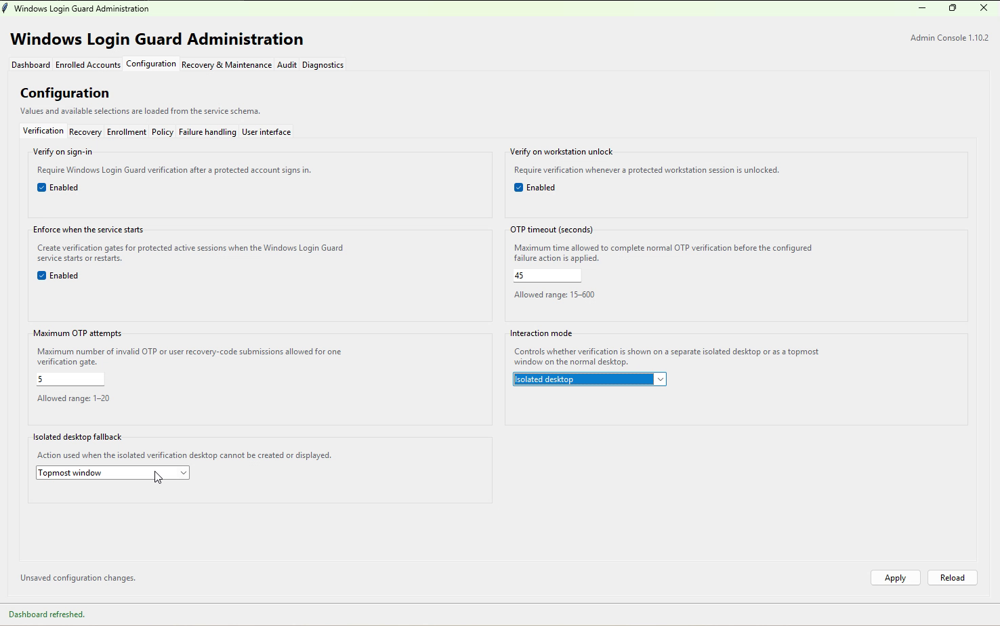

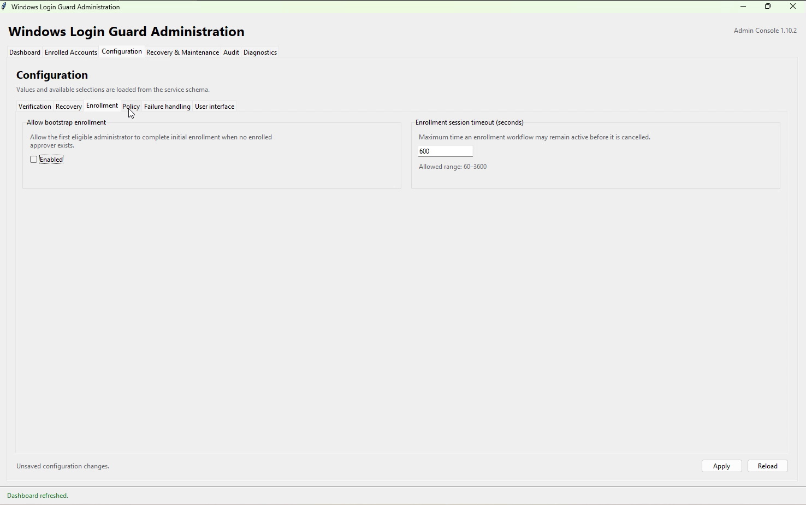

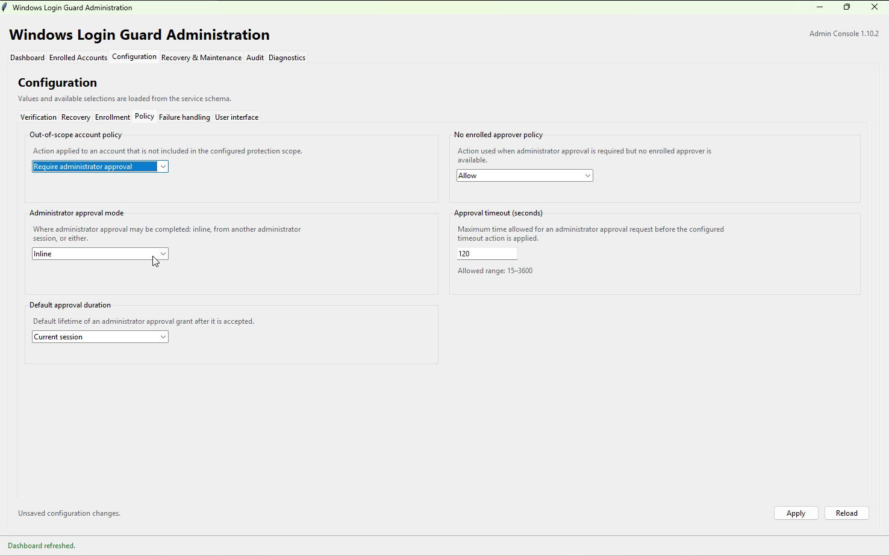

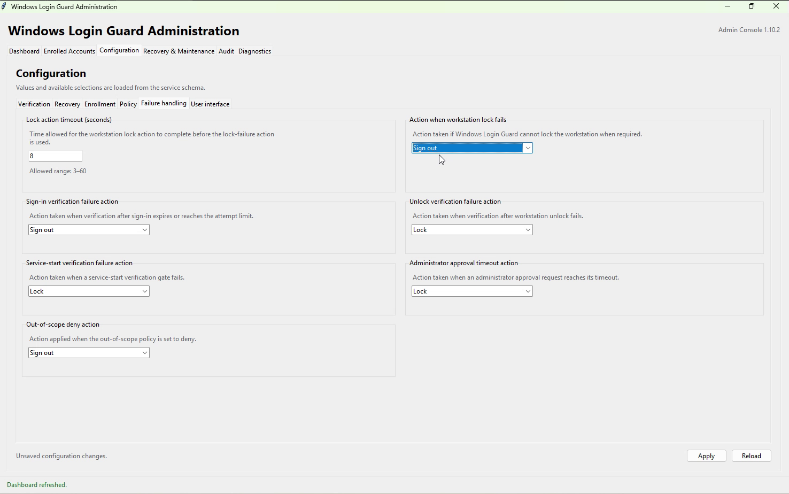

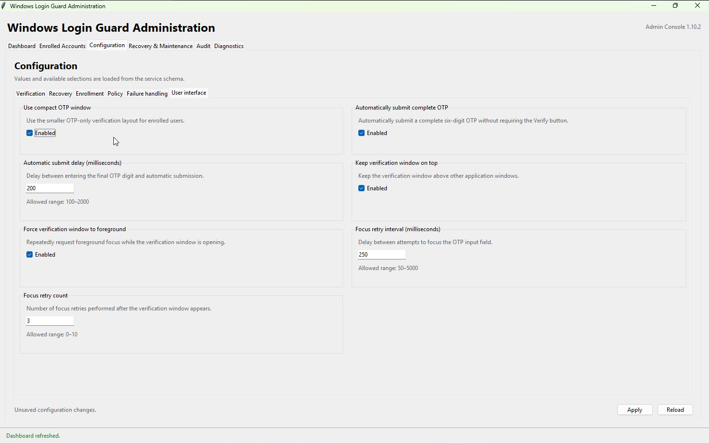

Full reference:
[Configuration Reference](docs/CONFIGURATION.md).

## Diagnostics and troubleshooting

Run from the installed program directory:

```powershell
& "C:\Program Files\WindowsLoginGuard\diagnose.ps1"
```

Check version and service:

```powershell
Get-Content "C:\Program Files\WindowsLoginGuard\VERSION"
Get-Service WindowsLoginGuard
```

Restart the service:

```powershell
Restart-Service WindowsLoginGuard -Force
```

A service restart clears any session-only F8 recovery bypass.

Review logs:

```powershell
Get-Content `
    "C:\ProgramData\WindowsLoginGuard\secure\guard.log" `
    -Tail 100

Get-Content `
    "C:\ProgramData\WindowsLoginGuard\secure\admin_audit.jsonl" `
    -Tail 100
```

Audit records include challenge creation, invalid OTP attempts, successful
verification, timeouts, attempt-limit actions, maintenance-key rotation,
break-glass recovery, maintenance changes, OTP resets, recovery-code
regeneration, configuration changes, and remote commands. OTP values and
recovery keys are not written to the audit log.

Full procedures:
[Troubleshooting](docs/TROUBLESHOOTING.md).

## Optional remote management

Remote management may be added after local protection is installed and tested.
Existing local enrollment is preserved.

It adds central inventory, approval requests, background notifications, remote
Approve/Deny, remote Lock/Log Off, and central audit.

For a normal management-server installation, `-DnsName` and `-Port` are
optional:

```powershell
.\test-prerequisites.ps1 -Role ManagementServer
.\install-remote-server.ps1
```

The defaults are the current Windows computer name and TCP 8443. Explicit
values are needed only for a deliberately configured DNS alias or FQDN, or a
different HTTPS port.

To register another protected PC, generate its installer bundle on the
management server:

```powershell
& "C:\Program Files\WindowsLoginGuardRemoteServer\new-protected-pc-installer.ps1" `
    -Label "Accounting-PC" `
    -ValidHours 24
```

Transfer the generated ZIP to the target PC, extract it, and run
`install-protected-pc.ps1` as Administrator. The bundle already contains the
server URL, public certificate, display name, and single-use registration
code.

The protected PC appears in Remote Administration after registration completes
and the Remote Agent performs its first synchronization.

See [Optional Remote Management](REMOTE_MANAGEMENT.md) for management-server,
protected-PC, and separate Admin-PC installation.

## Upgrade and uninstall

Upgrade an installed protected PC:

```powershell
.\upgrade.ps1
```

The upgrade stops the service and active UI processes, creates a timestamped
backup, replaces program modules, preserves protected state, validates service
imports and hidden UI startup, restarts the service, and verifies operation.

Verify afterward:

```powershell
Get-Content "C:\Program Files\WindowsLoginGuard\VERSION"
Get-Service WindowsLoginGuard
```

Uninstall:

```powershell
& "C:\Program Files\WindowsLoginGuard\uninstall.ps1"
```

Retain configuration and per-user enrollment:

```powershell
& "C:\Program Files\WindowsLoginGuard\uninstall.ps1" `
    -KeepEnrollment
```

See [Upgrade and Uninstall](docs/UPGRADE_AND_UNINSTALL.md).

## File locations

Program files:

```text
C:\Program Files\WindowsLoginGuard
```

Protected data:

```text
C:\ProgramData\WindowsLoginGuard\secure
```

Runtime IPC data:

```text
C:\ProgramData\WindowsLoginGuard\runtime
```

Important protected files include:

```text
config.json
management.token
maintenance-key.sha256
maintenance.json
admin_audit.jsonl
guard.log
users\
```

The plaintext maintenance recovery key is not stored there.

See [File Locations](docs/FILE_LOCATIONS.md).

## Limitations

- Windows Login Guard is post-login enforcement, not pre-authentication.
- The Windows desktop may become visible briefly before the verification UI.
- Local administrators remain part of the trust boundary.
- Unrestricted offline access to an unencrypted volume can alter enforcement.
- Maintenance mode intentionally bypasses OTP enforcement.
- WinRE drive letters and available tools vary across Windows builds.
- A remote server outage prevents remote actions but not local OTP protection.
- Test installation, enrollment, verification, recovery codes, hidden F8
  recovery, maintenance, Safe Mode/WinRE recovery, upgrades, and uninstall
  before production deployment.

For the strongest post-login presentation:

```json
{
  "interaction_mode": "isolated_desktop",
  "isolated_desktop_fallback": "topmost"
}
```

Windows Login Guard creates the verification gate before waiting for the UI
process, allowing the first UI status poll to move directly to the isolated
verification desktop. It remains a post-login control and cannot provide the
same pre-desktop guarantee as a Credential Provider.

## Documentation

- [Documentation index](docs/README.md)
- [Windows Installation Prerequisites](docs/PREREQUISITES.md)
- [Installation and First Enrollment](docs/INSTALLATION.md)
- [Finding a Windows Account SID](docs/ACCOUNT_SIDS.md)
- [Local Administration Guide](docs/LOCAL_ADMINISTRATION.md)
- [Configuration Reference](docs/CONFIGURATION.md)
- [Recovery and Maintenance](docs/RECOVERY_AND_MAINTENANCE.md)
- [Local Security Model](docs/SECURITY_MODEL.md)
- [Diagnostics and Troubleshooting](docs/TROUBLESHOOTING.md)
- [Upgrade and Uninstall](docs/UPGRADE_AND_UNINSTALL.md)
- [File Locations](docs/FILE_LOCATIONS.md)
- [Lab Screenshot Notes](docs/SCREENSHOTS.md)
- [Optional Remote Management](REMOTE_MANAGEMENT.md)
- [Release Notes](RELEASE_NOTES.md)


## Video Demonstration

Watch the complete Windows Login Guard walkthrough, including:

- prerequisite validation and installation;
- account-specific TOTP enrollment;
- recovery-code generation;
- local Administration console;
- verification and policy configuration;
- maintenance and recovery controls;
- session verification and administrator approval;
- audit review.

[](https://www.youtube.com/watch?v=Gmk7dJPi7tI)

[Watch directly on YouTube](https://www.youtube.com/watch?v=Gmk7dJPi7tI)