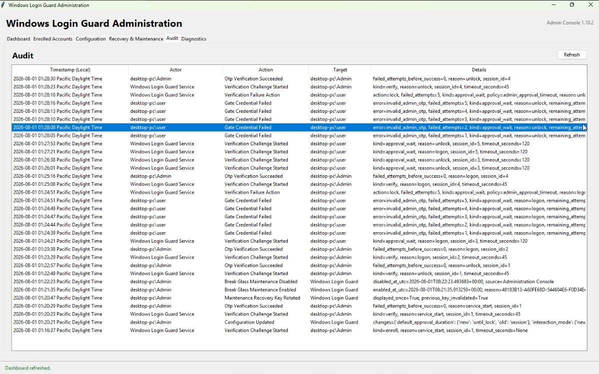

# Local Administration Guide

Windows Login Guard Administration manages the service installed on the same
PC. It is available without remote management.

## Open the console

Use the elevated desktop shortcut:

```text
Windows Login Guard Administration
```

Or run:

```powershell
& "C:\Program Files\WindowsLoginGuard\open-admin.ps1"
```


## Dashboard

The read-only Dashboard shows Admin-console and service versions, version
mismatch, service state, startup type, PID, start time, uptime, health checks,
notifications, maintenance state, enrollment totals, active sessions,
verification gates, timers, failed attempts, F8 readiness, and recent
activity.

It refreshes every five seconds, detects restarts, reconnects automatically,
and displays explicit IPC or service errors.

## Enrolled Accounts


The table shows account, role, enrollment state, remaining recovery codes, and
last recovery-code generation time.

**Regenerate Recovery Codes** invalidates all previous unused codes but does not
change the TOTP secret.

**Reset OTP Enrollment** removes the selected account's TOTP secret and
recovery-code hashes.

## Configuration

The editor is schema-driven.


Checkboxes, read-only selections, and bounded numeric fields are validated
before Apply. The service performs authoritative validation, writes
`config.json` atomically, audits old and new values, restarts, and reconnects.

## Recovery & Maintenance


Enable/disable maintenance requires an enrolled administrator credential and
the machine maintenance key. Enabling also requires a reason.

Maintenance-key rotation requires an enrolled administrator credential but not
the old key.

## Audit



Stored UTC timestamps are shown as **Timestamp (Local)**.

## Diagnostics

The Diagnostics tab checks the Windows service, IPC endpoint, configuration,
secure storage, audit storage, maintenance-key presence, DPAPI, important file
paths, and component versions.

Command-line check:

```powershell
& "C:\Program Files\WindowsLoginGuard\diagnose.ps1"
```

## Find an account SID for enrollment authorization

The current elevated PowerShell identity:

```powershell
whoami /user
```

All local accounts:

```powershell
Get-LocalUser |
    Select-Object Name, Enabled, SID
```

A specific local account:

```powershell
$targetSid = (
    Get-LocalUser -Name "AccountName"
).SID.Value
```

Then:

```powershell
& "C:\Program Files\WindowsLoginGuard\authorize-initial-enrollment.ps1" `
    -UserSid $targetSid
```

When the elevated shell belongs to a different administrator, use the
interactive-user method documented in
[Finding a Windows Account SID](ACCOUNT_SIDS.md).
