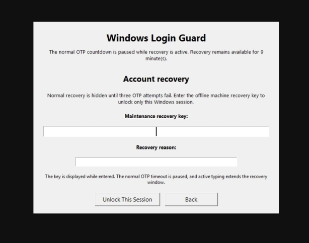

# Recovery and Maintenance

## User recovery codes

A one-time user recovery code may be entered in the normal OTP field. It is
account-specific and stored only as a hash.

## Hidden F8 session recovery

The normal OTP screen does not show a recovery control. F8 becomes available
only after the configured failed-attempt threshold, which defaults to three.

Once F8 has pressed after failed-attempt threshold, Account recovery will be shown, where you can entered the maintenance recovery key. 


The recovery workflow requires the machine maintenance key and a reason. It
formats the key into groups, pauses the normal OTP timeout, extends the
recovery-entry timeout while typing, and unlocks only the current session.

The bypass is cleared by workstation lock, sign-out, or service restart. It
cannot enable machine-wide maintenance.

## Maintenance-key rotation

An enrolled administrator may rotate a lost or exposed maintenance key without
the old key. The previous key is invalidated immediately.

## Machine-wide maintenance


Maintenance disables OTP enforcement for all protected sessions. Enabling
requires confirmation, a reason, an enrolled administrator credential, and the
machine maintenance key. The event is audited and remains active until
explicitly disabled.

## Safe Mode

```cmd
cd /d "C:\Program Files\WindowsLoginGuard"
wlg-recovery.cmd enable
```

Use Windows Advanced Startup → Troubleshoot → Advanced options → Startup
Settings, then start Safe Mode and run Command Prompt as Administrator.

## WinRE

Hold Shift while selecting Restart, then use Troubleshoot → Advanced options →
Command Prompt. Unlock BitLocker if required. Windows may be mounted as `D:`:

```cmd
D:
cd "\Program Files\WindowsLoginGuard"
wlg-recovery.cmd enable
```

The script searches mounted drives for
`ProgramData\WindowsLoginGuard\secure\maintenance-key.sha256`.

Disable later with:

```cmd
wlg-recovery.cmd disable
```

